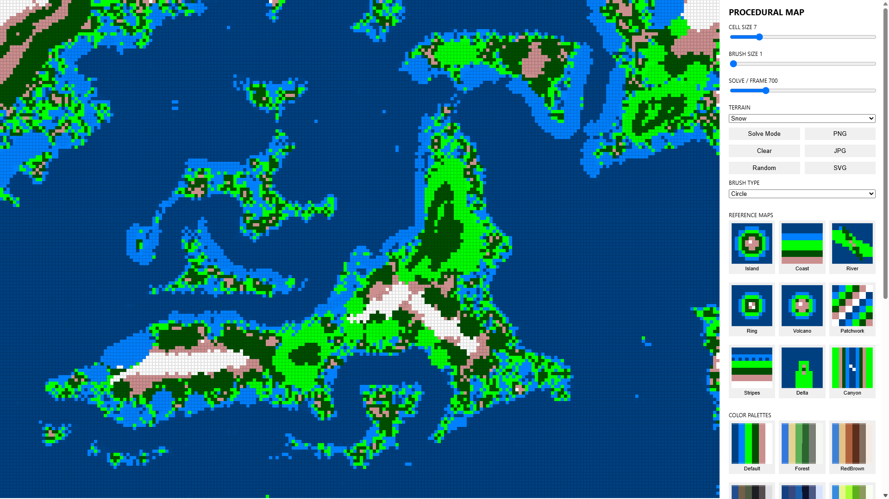

# Procedural Map Generator
An interactive browser-based procedural map generation demo built with p5.js.

Generates coherent terrain maps from simple local pattern references using a constraint-inspired solver. It renders a tile grid of terrain types and continuously improves the map by selecting the best terrain for each cell using neighbor rule scoring.

The demo supports user interaction to paint and lock terrain, choose brush shapes, switch palettes, select reference map patterns, randomize seed values, and export generated maps as PNG, JPG, or SVG.

## Result

## References
- Shaker, N., Togelius, J., & Nelson, M. J. (2016). Procedural Content Generation in Games: A Textbook and an Overview of Current Research. MIT Press.
- Hendrikx, M., Meijer, S., van der Velden, J., & Iosup, A. (2013). Procedural content generation for games: A survey. ACM Transactions on Multimedia Computing, Communications, and Applications (TOMM), 9(1), 1–22.
- Perlin, K. (1985). An image synthesizer. ACM SIGGRAPH Computer Graphics, 19(3), 287–296.
- Li, S. Z. (2009). Markov Random Field Modeling in Image Analysis. Springer.
- Gumin, M. (2016). WaveFunctionCollapse : https://github.com/mxgmn/WaveFunctionCollapse